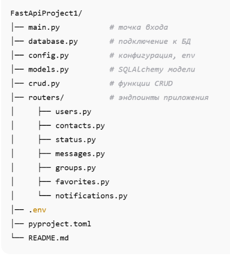

Тестовый проект на FastAPI с реализацией авторизации, личных сообщений,
статусов пользователей, уведомлений и списка контактов.

📌 Содержание

- Описание
- Технологии
- Функциональность
- Архитектура проекта
- Установка и запуск
- To Do
- Автор

🧩 Описание

FastApiProject1 — учебный проект, демонстрирующий работу:
FastAPI
JWT авторизации
PostgreSQL
SQLAlchemy ORM
Pydantic валидации
Асинхронного и синхронного доступа к базе

⚙️ Технологии

- python = "^3.12"
- fastapi = "^0.116.1"
- uvicorn = "^0.35.0"
- sqlalchemy = "^2.0.44"
- asyncpg = "^0.30.0"
- databases = "^0.9.0"
- python-multipart = "^0.0.20"
- email-validator = "^2.3.0"
- itsdangerous = "^2.2.0"
- passlib = {extras = ["argon2"], version = "^1.7.4"}
- python-jose = "^3.5.0"
- python-dotenv = "^0.9.9"
- psycopg2-binary = "^2.9.11"
- pydantic = "^2.12.4"
- argon2-cffi = "^25.1.0"

🧑‍💻 Функциональность

Реализовано:
- Настройка базы данных PostgreSQL
- Создание моделей SQLAlchemy
- CRUD-операции
- JWT + OAuth2 авторизация
- Личные сообщения
- Список контактов
- Групповые чаты
- Статусы пользователей
- Уведомления
- Избранные сообщения
- Профиль пользователя

📁 Архитектура проекта

🛠 Установка и запуск 

Локальный запуск

1. Клонируем проект 
git clone https://github.com/EugenyBaz/FastApiProject1
cd FastApiProject1

2. Устанавливаем зависимости 
poetry install

3. Создаём виртуальное окружение
.env (на основе .env.example): copy .env.example .env

4. Запуск сервера
uvicorn main:app --reload

👉 http://127.0.0.1:8000
👉 Документация Swagger: http://127.0.0.1:8000/docs

📝 To Do

1. подключение Alembic
2. тестирование  pytest
3. Docker + docker-compose

👤 Автор

Евгений Базавод — Backend Developer